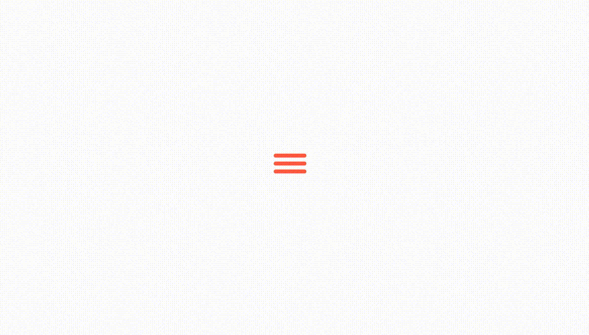
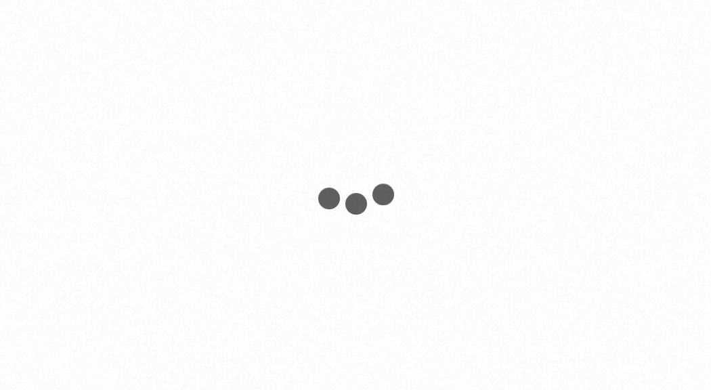
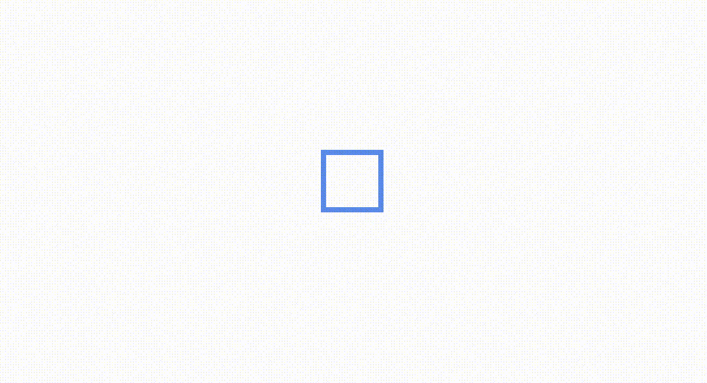
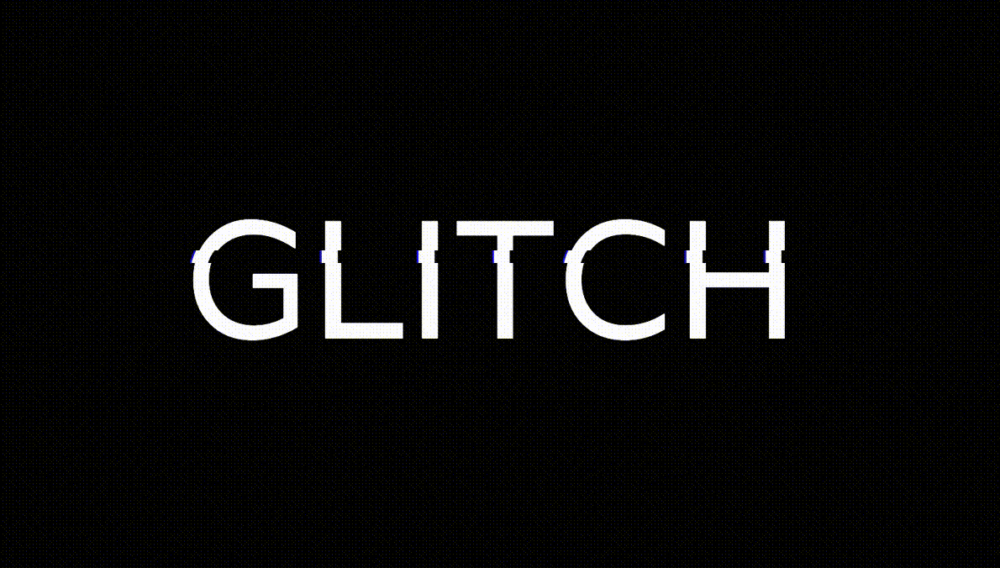

# CSS Effects

This project contains a collection of fancy CSS animations that are either reproduced or
originally created from the Internet. The demos are implemented in purely HTML + CSS + JavaScript.

## Examples
### Dynamic Menu Button

### Wave Dots

### Rotating Squares

### Glitch Text

## Reference

- [CodePen](https://codepen.io/), a social development environment for front-end designers and
  developers.